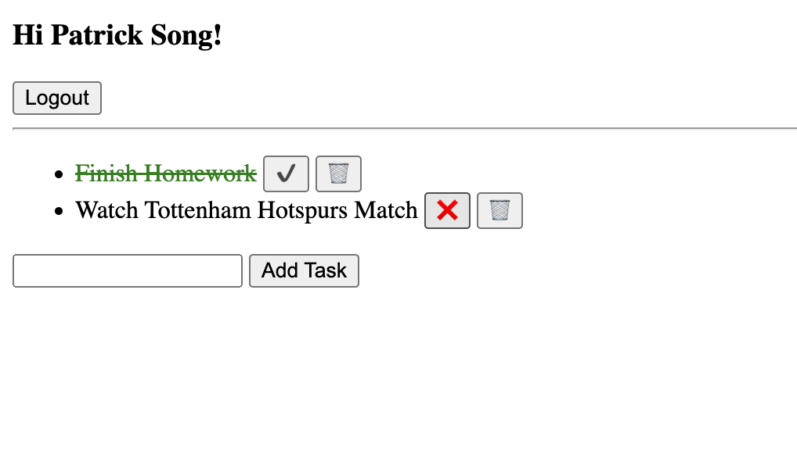
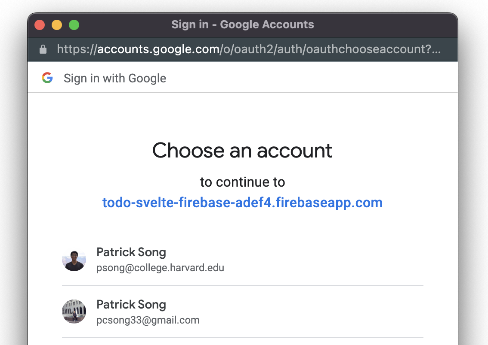

# TODO app with Svelte and Firebase

https://fireship.io/lessons/svelte-v3-overview-firebase/

### Interface


### Google Authentication with Firebase



## Initializing Firebase

If you are new to Firebase, complete the following steps.

- Go to https://console.firebase.google.com/u/0/ and create a project
- Create a Firestore Databse and enable the following settings

1. Authentication > Sign-in method > Enable Google
2. Database > Rules > change to ```true```
3. Database > Indexes > Add Index 

Create a .env file with your Firebase creds:

```typescript
VITE_FIREBASE_APIKEY=
VITE_FIREBASE_AUTH_DOMAIN=
VITE_FIREBASE_PROJECT_ID=
VITE_FIREBASE_STORAGE_BUCKET=
VITE_FIREBASE_MESSAGING_SENDER_ID=
VITE_FIREBASE_APP_ID=
VITE_FIREBASE_MEASUREMENT_ID=
```

## Run Project Locally

Once you've created a project and installed dependencies with `npm install` (or `pnpm install` or `yarn`), start a development server:

```bash
npm run dev

# or start the server and open the app in a new browser tab
npm run dev -- --open
```

